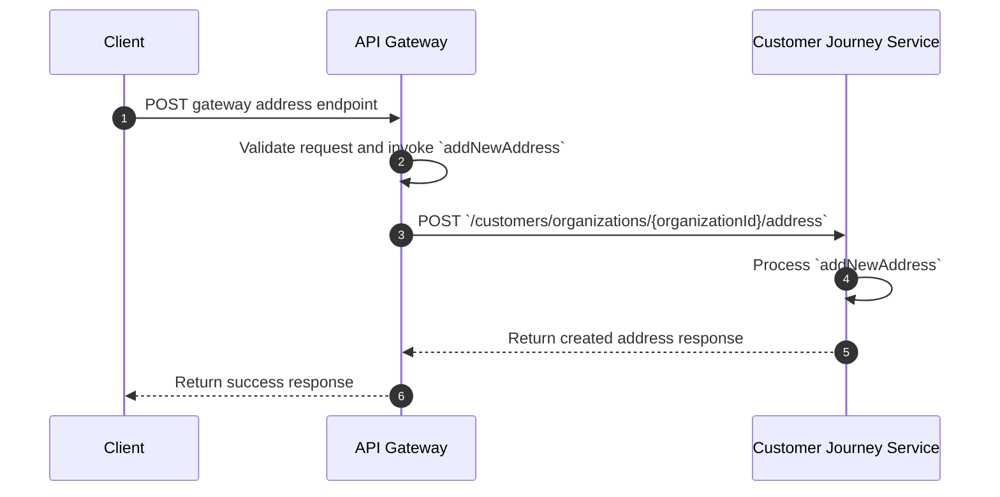

# Add New Address Flow

`Gateway addNewAddress -> customer-journey-service addNewAddress`

```mermaid
sequenceDiagram
    autonumber

    participant Client as Client
    participant GW as API Gateway
    participant CJS as Customer Journey Service

    Client->>GW: POST gateway address endpoint
    GW->>GW: Validate request and invoke `addNewAddress`
    GW->>CJS: POST `/customers/organizations/{organizationId}/address`
    CJS->>CJS: Process `addNewAddress`
    CJS-->>GW: Return created address response
    GW-->>Client: Return success response
```
