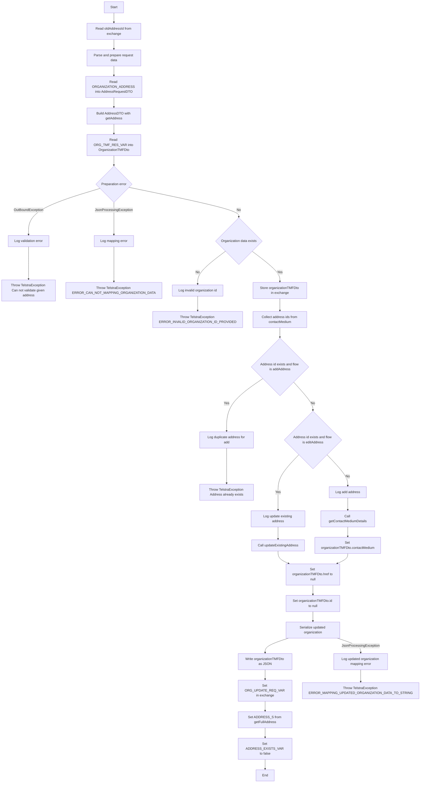

# Add New Address Functionality

`addAndEditAddressForOrganization(exchange)`

```mermaid
flowchart TD
    A[Start] --> B[Read oldAddressId from exchange]
    B --> C[Parse and prepare request data]
    C --> C1[Read ORGANIZATION_ADDRESS into AddressRequestDTO]
    C1 --> C2[Build AddressDTO with getAddress]
    C2 --> C3[Read ORG_TMF_RES_VAR into OrganizationTMFDto]

    C3 --> D{Preparation error}
    D -->|OutBoundException| E[Log validation error]
    E --> F[Throw TelstraException Can not validate given address]

    D -->|JsonProcessingException| G[Log mapping error]
    G --> H[Throw TelstraException ERROR_CAN_NOT_MAPPING_ORGANIZATION_DATA]

    D -->|No| I{Organization data exists}
    I -->|No| J[Log invalid organization id]
    J --> K[Throw TelstraException ERROR_INVALID_ORGANIZATION_ID_PROVIDED]

    I -->|Yes| L[Store organizationTMFDto in exchange]
    L --> M[Collect address ids from contactMedium]

    M --> N{Address id exists and flow is addAddress}
    N -->|Yes| O[Log duplicate address for add]
    O --> P[Throw TelstraException Address already exists]

    N -->|No| Q{Address id exists and flow is editAddress}
    Q -->|Yes| R[Log update existing address]
    R --> S[Call updateExistingAddress]

    Q -->|No| T[Log add address]
    T --> U[Call getContactMediumDetails]
    U --> V[Set organizationTMFDto.contactMedium]

    S --> W[Set organizationTMFDto.href to null]
    V --> W
    W --> X[Set organizationTMFDto.id to null]

    X --> Y[Serialize updated organization]
    Y --> Z[Write organizationTMFDto as JSON]
    Z --> AA[Set ORG_UPDATE_REQ_VAR in exchange]
    AA --> AB[Set ADDRESS_S from getFullAddress]
    AB --> AC[Set ADDRESS_EXISTS_VAR to false]
    AC --> AD[End]

    Y -->|JsonProcessingException| AE[Log updated organization mapping error]
    AE --> AF[Throw TelstraException ERROR_MAPPING_UPDATED_ORGANIZATION_DATA_TO_STRING]
```
