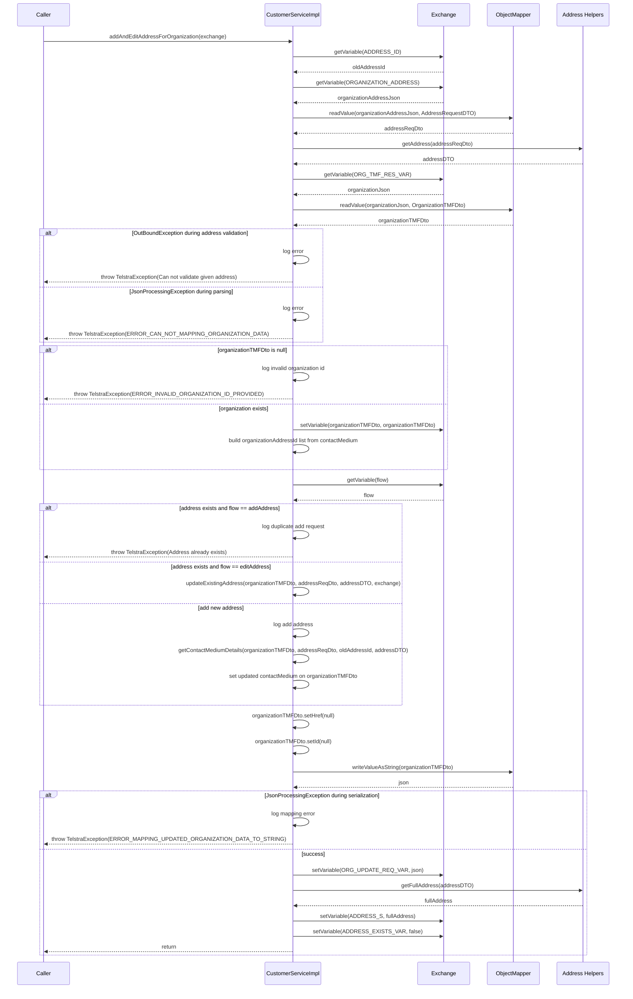

# Add And Edit Address For Organization Sequence

`addAndEditAddressForOrganization(exchange)`

```mermaid
sequenceDiagram
    participant Caller
    participant CS as CustomerServiceImpl
    participant Ex as Exchange
    participant OM as ObjectMapper
    participant Addr as Address Helpers

    Caller->>CS: addAndEditAddressForOrganization(exchange)

    CS->>Ex: getVariable(ADDRESS_ID)
    Ex-->>CS: oldAddressId

    CS->>Ex: getVariable(ORGANIZATION_ADDRESS)
    Ex-->>CS: organizationAddressJson
    CS->>OM: readValue(organizationAddressJson, AddressRequestDTO)
    OM-->>CS: addressReqDto

    CS->>Addr: getAddress(addressReqDto)
    Addr-->>CS: addressDTO

    CS->>Ex: getVariable(ORG_TMF_RES_VAR)
    Ex-->>CS: organizationJson
    CS->>OM: readValue(organizationJson, OrganizationTMFDto)
    OM-->>CS: organizationTMFDto

    alt OutBoundException during address validation
        CS->>CS: log error
        CS-->>Caller: throw TelstraException(Can not validate given address)
    else JsonProcessingException during parsing
        CS->>CS: log error
        CS-->>Caller: throw TelstraException(ERROR_CAN_NOT_MAPPING_ORGANIZATION_DATA)
    end

    alt organizationTMFDto is null
        CS->>CS: log invalid organization id
        CS-->>Caller: throw TelstraException(ERROR_INVALID_ORGANIZATION_ID_PROVIDED)
    else organization exists
        CS->>Ex: setVariable(organizationTMFDto, organizationTMFDto)
        CS->>CS: build organizationAddressId list from contactMedium
    end

    CS->>Ex: getVariable(flow)
    Ex-->>CS: flow

    alt address exists and flow == addAddress
        CS->>CS: log duplicate add request
        CS-->>Caller: throw TelstraException(Address already exists)
    else address exists and flow == editAddress
        CS->>CS: updateExistingAddress(organizationTMFDto, addressReqDto, addressDTO, exchange)
    else add new address
        CS->>CS: log add address
        CS->>CS: getContactMediumDetails(organizationTMFDto, addressReqDto, oldAddressId, addressDTO)
        CS->>CS: set updated contactMedium on organizationTMFDto
    end

    CS->>CS: organizationTMFDto.setHref(null)
    CS->>CS: organizationTMFDto.setId(null)

    CS->>OM: writeValueAsString(organizationTMFDto)
    OM-->>CS: json

    alt JsonProcessingException during serialization
        CS->>CS: log mapping error
        CS-->>Caller: throw TelstraException(ERROR_MAPPING_UPDATED_ORGANIZATION_DATA_TO_STRING)
    else success
        CS->>Ex: setVariable(ORG_UPDATE_REQ_VAR, json)
        CS->>Addr: getFullAddress(addressDTO)
        Addr-->>CS: fullAddress
        CS->>Ex: setVariable(ADDRESS_S, fullAddress)
        CS->>Ex: setVariable(ADDRESS_EXISTS_VAR, false)
        CS-->>Caller: return
    end
```
