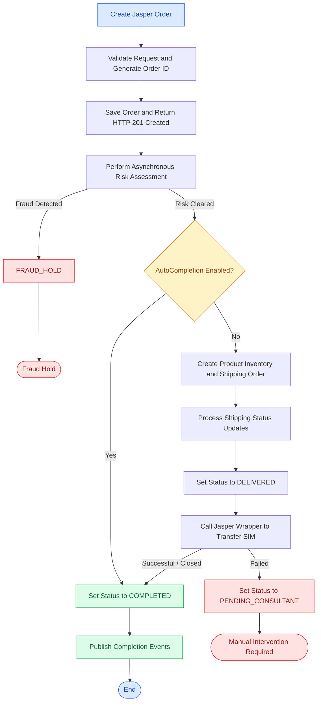

# Jasper Order Processing Flow

```mermaid
flowchart TD
    A["Create Jasper Order"] --> B["Validate Request and Generate Order ID"]
    B --> C["Save Order and Return HTTP 201 Created"]
    C --> D["Perform Asynchronous Risk Assessment"]

    D -->|Fraud Detected| E["FRAUD_HOLD"]
    D -->|Risk Cleared| F{"AutoCompletion Enabled?"}

    F -->|Yes| G["Set Status to COMPLETED"]
    F -->|No| H["Create Product Inventory and Shipping Order"]

    H --> I["Process Shipping Status Updates"]
    I --> J["Set Status to DELIVERED"]

    J --> K["Call Jasper Wrapper to Transfer SIM"]

    K -->|Successful / Closed| G
    K -->|Failed| L["Set Status to PENDING_CONSULTANT"]

    G --> M["Publish Completion Events"]
    M --> N([End])

    E --> O([Fraud Hold])
    L --> P([Manual Intervention Required])

    classDef startEnd fill:#dbeafe,stroke:#2563eb,color:#1e40af
    classDef decision fill:#fef3c7,stroke:#d97706,color:#92400e
    classDef success fill:#dcfce7,stroke:#16a34a,color:#166534
    classDef error fill:#fee2e2,stroke:#dc2626,color:#991b1b

    class A,N startEnd
    class F decision
    class G,M success
    class E,L,O,P error
```
