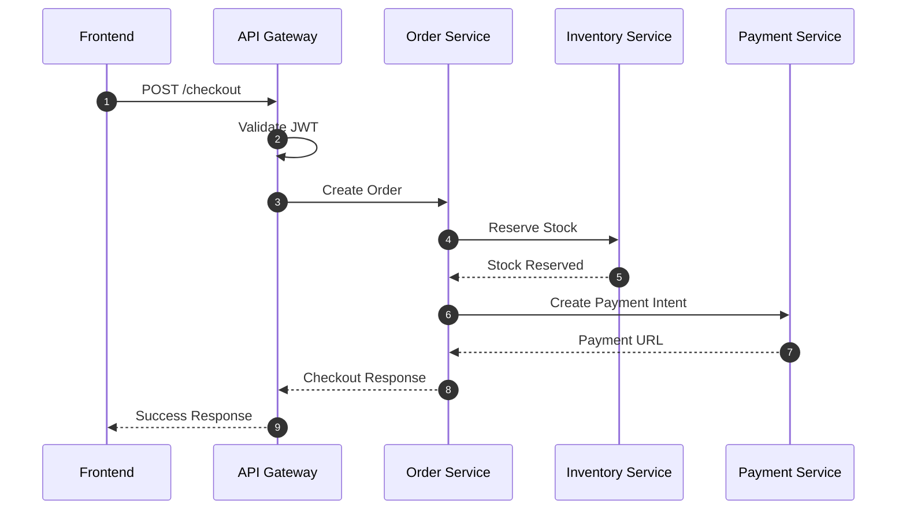

# Checkout Flow

```mermaid
sequenceDiagram
    autonumber

    participant FE as Frontend
    participant GW as API Gateway
    participant OS as Order Service
    participant IS as Inventory Service
    participant PS as Payment Service

    FE->>GW: POST /checkout
    GW->>GW: Validate JWT

    GW->>OS: Create Order

    OS->>IS: Reserve Stock
    IS-->>OS: Stock Reserved

    OS->>PS: Create Payment Intent
    PS-->>OS: Payment URL

    OS-->>GW: Checkout Response
    GW-->>FE: Success Response
```